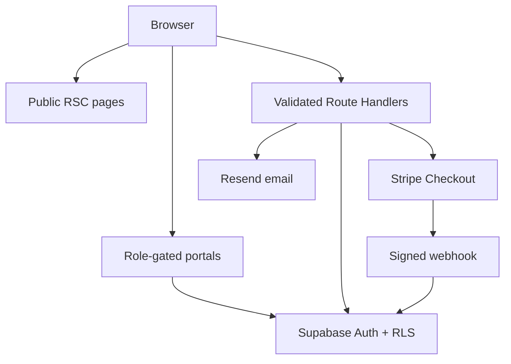
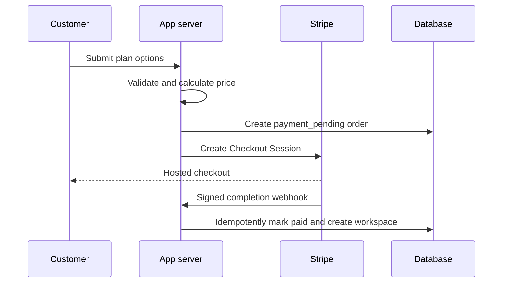

# Architecture

## System shape

Highground is split into five deliberate boundaries:

1. Public pages are statically rendered or server-rendered with minimal client JavaScript.
2. Authenticated portals use Supabase cookie sessions and server-side role gates.
3. Route Handlers validate input, authenticate the actor, authorize the resource, and then call privileged services.
4. PostgreSQL constraints and RLS enforce the same ownership model independently of the UI.
5. Stripe, Resend, Turnstile, and later Inngest are server-only integrations.



## Rendering and performance

- Public layouts and content components are Server Components unless interaction requires client state.
- The pricing calculator, coach filters, mobile menu, application form, and voice recorder are isolated Client Components.
- Portal and chat code is not imported by public marketing routes.
- No 3D engine, particle system, autoplay video, remote font, or third-party game artwork is loaded.
- Images added later must use `next/image`, explicit dimensions, responsive sizes, and private signed URLs where applicable.
- Chat queries use the `(conversation_id, created_at desc, id desc)` cursor index and should request bounded pages.

## Commerce sequence



The success redirect is informational only. `finalize_paid_order` checks the paid amount against the locked order total before it changes status or creates a conversation.

## Chat and media

- Every paid order has one private conversation.
- Membership can include the customer, assigned coach, authorized support staff, and administrators.
- The message API checks membership before insert; message RLS repeats the same check.
- Media upload authorization checks membership, MIME type, file size, and maps MIME to a server-chosen extension.
- Uploads go directly to a private bucket through a short-lived signed upload URL.
- Metadata is recorded only after the upload succeeds; private downloads should be served through time-limited signed URLs.
- Video thumbnails and malware scanning belong in background jobs before general availability.

## Folder map

```text
src/app                 App Router pages and Route Handlers
src/components          Layout, UI, public, form, marketplace, and portal components
src/lib/auth            Permission map and server role gates
src/lib/supabase        Browser, server, admin, and proxy clients
src/lib/payments        Server-only Stripe client
src/lib/validation      Shared Zod contracts
src/lib/data            Versioned public seed content
supabase/migrations     Schema, functions, constraints, indexes, RLS, buckets
scripts                 Idempotent service-role development seeding
tests                   Pure business-rule tests
docs                    Architecture and operating documentation
```
