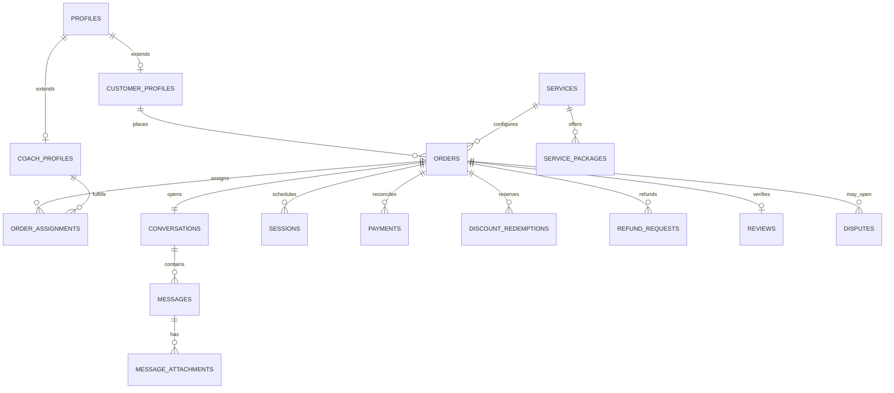

# Data model

The schema is normalized around identity, configurable services, immutable order context, private delivery, and independently reconcilable money movement.

## Invariants

- Every private identity begins in `auth.users` and has exactly one `profiles` row.
- The auth trigger always creates a `customer`; staff metadata cannot self-promote an account.
- Only one active booster assignment may exist per order. Legacy schema identifiers retain `coach` for migration compatibility.
- Only a completed order with a successful payment and completing booster can produce a verified review.
- A paid checkout amount must equal the order total before order finalization.
- Every paid order receives exactly one conversation.
- Client message IDs are unique per sender to support retry-safe optimistic sending.
- Refund totals cannot exceed captured totals.
- Concurrent discount reservations count toward global and per-customer limits and are committed only after payment.
- Stripe event timestamps prevent older webhook events from downgrading newer terminal payment state.
- Storage paths are private metadata; the database never stores public chat URLs.
- Admin-sensitive changes are intended to append audit records with before/after state and reason.

## Money units

All amounts are integer minor units. For CAD, `6900` means CAD 69.00. Currency values use lowercase ISO 4217 codes. Card numbers, CVC, and raw bank details never enter this database.
